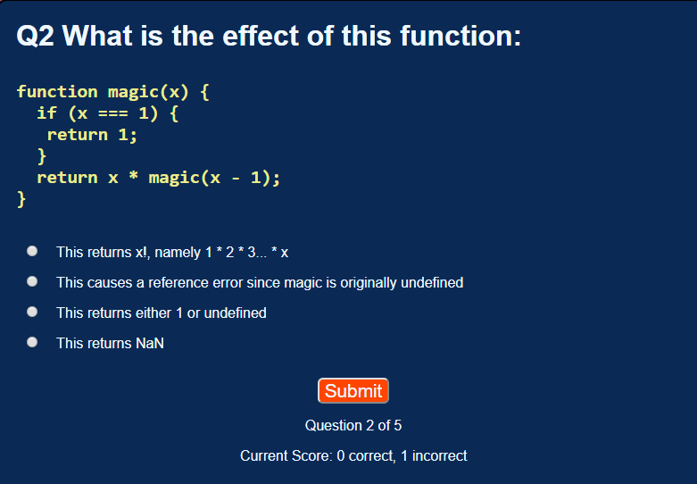

# JavaScript Quiz

## Authors

### David Bolin
### James Scherer

## Summary

A simple JavaScript quiz app testing the user's knowledge of a few odd features of JavaScript. Written in order to illustrate the use of basic frontend technologies.

## Live app

The live app is [here](https://thinkful-ei-bee.github.io/quiz-app-james-david/).

## Screenshots

## Tech stack

The client uses HTML, CSS3 and JavaScript ES6.
